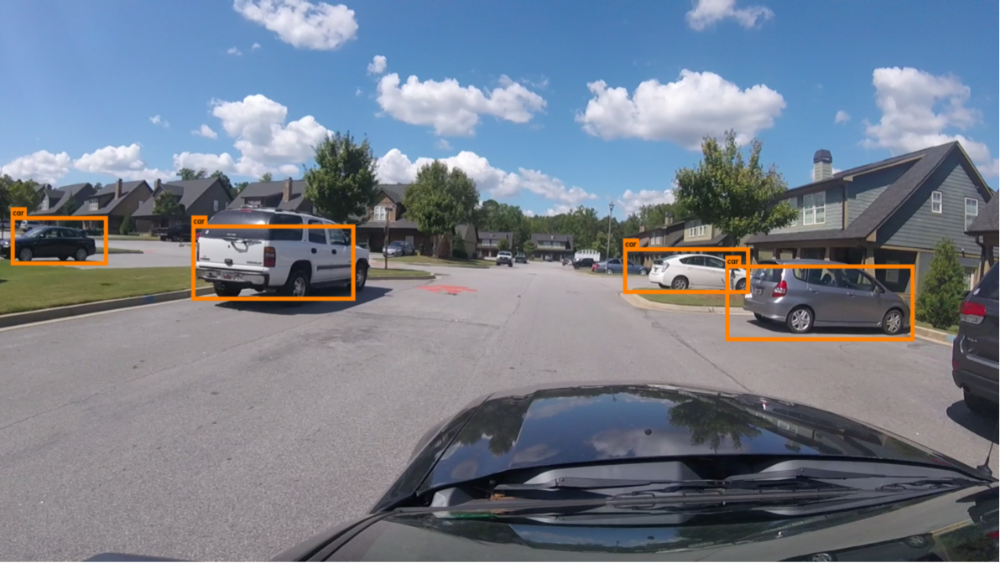
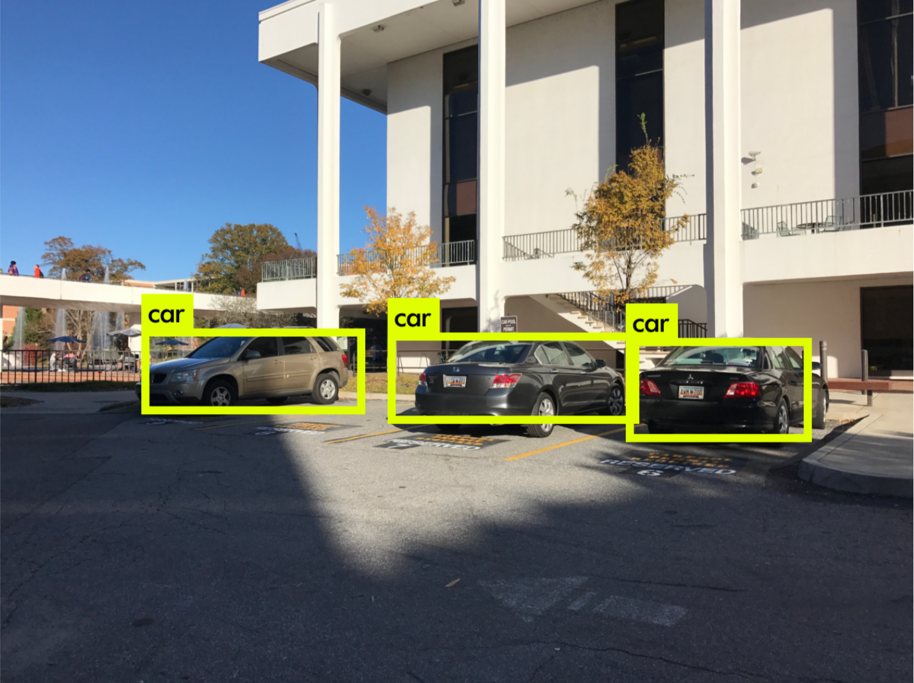

# Deep Learning-Big Data Creative Inquiry

This repository contains exploratory studies into datasets and deep learning techniques for object detection, segmentation, and many other machine learning applications.

**Graduate Team Members**:
	[Edwin Weill](<mailto:eweill@g.clemson.edu>),
	[Jesse Tetreault](<mailto:jtetrea@g.clemson.edu>),
	[Ankit Kulshrestha](<mailto:akulshr@g.clemson.edu>)

**Advisor**: 
	[Dr. Melissa Smith](http://www.clemson.edu/cecas/departments/ece/faculty_staff/faculty/msmith.html)

## Getting Started

New team members should look at the [Wiki](https://github.com/CUFCTL/dlbd-ci/wiki) which contains pages detailing preliminary information about deep learning, the Palmetto Cluster, professional document creation, and code sharing.

## Results

### Autonomous Driving Detection
 

### Label/Barcode Detection

### Architectural Diagram
The following is the YOLO architecture:
